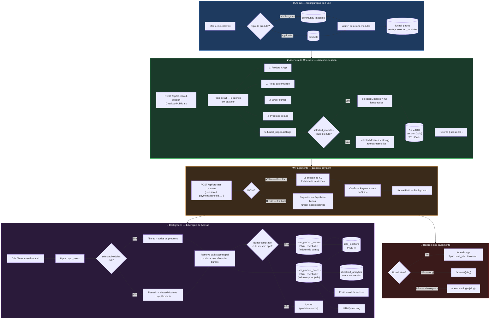

# Fluxo de Módulos para Liberação

> Documenta o ciclo completo: configuração no funil → sessão de checkout → pagamento → liberação de acesso.

---

## Fluxo Visual



---

## 1. Visão Geral

```
Admin configura módulos         Checkout abre           Cliente paga
  (ModuleSelector)         (checkout-session)       (process-payment)
       │                          │                        │
       ▼                          ▼                        ▼
funnel_pages.settings  ──►  KV Cache (30min)  ──►  user_product_access
 selected_modules[]              │                  (apenas os módulos
                                 └──► fallback: ◄── configurados)
                                      Supabase
```

---

## 2. Etapa 1 — Configuração pelo Admin

**Componente:** `packages/frontend/src/components/funnel/ModuleSelector.tsx`

O admin acessa a página de configuração do funil e seleciona quais módulos serão liberados após a compra.

### O que acontece:
1. O componente busca os módulos disponíveis dependendo do tipo de produto:
   - **`member_area`** → tabela `community_modules` (campo `member_area_id`)
   - **`application` / `community`** → tabela `products` (campo `application_id`)
2. O admin seleciona/desmarca módulos individualmente ou com "Selecionar todos"
3. Ao salvar, faz `UPDATE` em `funnel_pages`:

```json
{
  "settings": {
    "selected_modules": ["uuid-modulo-1", "uuid-modulo-2"]
  }
}
```

### Regras:
| Cenário | Comportamento |
|---------|--------------|
| Array com IDs | Libera **apenas** os módulos listados |
| Array vazio | Libera **todos** os módulos |
| Campo ausente | Libera **todos** os módulos |

---

## 3. Etapa 2 — Abertura do Checkout (Pré-carregamento)

**Handler:** `workers/src/handlers/checkout-session.ts`  
**Endpoint:** `POST https://api.clicknich.com/api/checkout-session`

Chamado automaticamente quando o checkout **abre** (antes de o cliente preencher qualquer coisa).

### O que acontece (em paralelo):
```
Promise.all([
  1. Busca produto (applications ou marketplace_products)
  2. Busca preço customizado (checkouts.custom_price)
  3. Busca order bumps do checkout (checkout_offers)
  4. Busca produtos do app (products WHERE application_id)
  5. Busca módulos configurados (funnel_pages.settings WHERE checkout_id)
])
```

### Lógica de `selected_modules`:
```typescript
// funnel_pages -> settings -> selected_modules
const funnelPageSettings = funnelPageResult.data?.settings
const selectedModules = Array.isArray(funnelPageSettings?.selected_modules)
  && funnelPageSettings.selected_modules.length > 0
    ? funnelPageSettings.selected_modules  // array com IDs
    : null                                  // null = liberar todos
```

### Resultado:
Todos os dados são persistidos no **Cloudflare KV** com TTL de 30 minutos:

```typescript
// Chave: session:{uuid}
{
  sessionId,
  productId,
  productType,       // 'app' | 'marketplace'
  applicationId,
  productName,
  finalPrice,
  currency,
  sellerOwnerId,
  checkoutId,
  bumpOffers,        // preços verificados server-side
  appProductIds,     // todos os produtos do app
  selectedModules,   // null ou string[]
}
```

A resposta retorna `{ sessionId }` para o frontend.

---

## 4. Etapa 3 — Processamento do Pagamento

**Handler:** `workers/src/handlers/process-payment.ts`  
**Endpoint:** `POST https://api.clicknich.com/api/process-payment`

### Fast Path (KV hit):
Se o `sessionId` foi fornecido e a sessão ainda está no KV:
- Lê `selectedModules` diretamente do cache
- Faz apenas **2 chamadas externas** (Stripe + Supabase user check)

### Fallback (KV miss):
Se não há `sessionId` ou a sessão expirou:
- Executa `Promise.all` completo com 9 queries ao Supabase
- Busca `funnel_pages.settings` diretamente para obter `selected_modules`

### Filtro de módulos na liberação de acesso:

```typescript
// Dentro do fluxo de apps (productType === 'app')
const productsToGrant = (() => {
  let filtered = appProducts  // todos os produtos do app

  // 1. Aplicar filtro de selected_modules (se configurado)
  if (funnelSelectedModulesData && funnelSelectedModulesData.length > 0) {
    filtered = filtered.filter(p => funnelSelectedModulesData.includes(p.id))
    // log: "🔒 selected_modules: liberando X/Y módulos"
  }

  // 2. Excluir produtos de order bump (têm acesso separado)
  if (orderBumpProductIds.length > 0) {
    filtered = filtered.filter(p => !orderBumpProductIds.includes(p.id))
  }

  return filtered
})()
```

### Gravação em `user_product_access`:

```typescript
const accessRecords = productsToGrant.map(product => ({
  user_id: userId,
  product_id: product.id,       // apenas os módulos filtrados
  application_id: applicationId,
  access_type: 'purchase',
  is_active: true,
  payment_id: paymentIntent.id,
  payment_status: 'completed',
  purchase_price: totalChargeAmount,
  // ...
}))

await supabase.from('user_product_access')
  .upsert(accessRecords, { onConflict: 'user_id,product_id' })
```

---

## 5. Tabelas Envolvidas

| Tabela | Papel |
|--------|-------|
| `funnel_pages` | Armazena `settings.selected_modules` (configuração do admin) |
| `community_modules` | Módulos de área de membros (member_area) |
| `products` | Módulos/produtos de aplicativos |
| `checkout_offers` | Order bumps e upsells do checkout |
| `user_product_access` | Acesso final liberado por produto para o usuário |
| `user_member_area_access` | Acesso para produtos de marketplace |
| `app_users` | Usuário do app criado/atualizado na compra |
| `sale_locations` | Registro da venda com geolocalização |
| `checkout_analytics` | Evento de conversão |

---

## 6. Diagrama Completo

```
┌─────────────────────────────────────────────────────────────────┐
│  ADMIN — Configuração do Funil                                  │
│                                                                 │
│  ModuleSelector.tsx                                             │
│  ├─ Busca módulos: community_modules / products                 │
│  ├─ Admin seleciona quais serão liberados                       │
│  └─ Salva em: funnel_pages.settings.selected_modules            │
└───────────────────────────┬─────────────────────────────────────┘
                            │
                            ▼
┌─────────────────────────────────────────────────────────────────┐
│  CLIENTE — Abre o Checkout                                      │
│                                                                 │
│  CheckoutPublic.tsx → POST /api/checkout-session                │
│  ├─ Busca produto, preço, bumps, módulos (em paralelo)          │
│  ├─ selected_modules = funnel_pages.settings.selected_modules   │
│  │   (null se vazio = liberar todos)                            │
│  └─ Persiste tudo no KV: session:{uuid} — TTL 30min             │
│                                                                 │
│  Retorna: { sessionId }                                         │
└───────────────────────────┬─────────────────────────────────────┘
                            │
                            ▼
┌─────────────────────────────────────────────────────────────────┐
│  CLIENTE — Clica em "Pagar"                                     │
│                                                                 │
│  POST /api/process-payment  (sessionId no body)                 │
│  │                                                              │
│  ├─ [FAST PATH] KV hit → lê selectedModules do cache           │
│  │   └─ Apenas 2 chamadas externas (Stripe + user check)        │
│  │                                                              │
│  └─ [FALLBACK] KV miss → 9 queries ao Supabase                 │
│      └─ Busca funnel_pages.settings.selected_modules            │
│                                                                 │
│  Stripe: confirma PaymentIntent                                 │
│                                                                 │
│  Background (waitUntil):                                        │
│  ├─ Cria/busca usuário auth                                     │
│  ├─ Upsert app_users                                            │
│  ├─ Filtra módulos:                                             │
│  │   ├─ selectedModules != null → libera apenas os selecionados │
│  │   └─ selectedModules == null → libera todos                  │
│  ├─ Remove bump modules da lista principal                      │
│  ├─ INSERT user_product_access (módulos principais)             │
│  ├─ Bump comprado do mesmo app? → INSERT user_product_access    │
│  ├─ INSERT sale_locations                                       │
│  ├─ INSERT checkout_analytics (evento: conversion)             │
│  ├─ UPDATE user_product_access (thankyou_token)                 │
│  ├─ Envia email de acesso                                       │
│  └─ UTMify tracking                                             │
│                                                                 │
│  Resposta imediata: { success, purchaseId, redirectUrl }        │
└───────────────────────────┬─────────────────────────────────────┘
                            │
                            ▼
┌─────────────────────────────────────────────────────────────────┐
│  REDIRECT                                                       │
│  ├─ Upsell ativo? → /upsell-page?purchase_id=...&token=...     │
│  └─ Sem upsell?                                                 │
│      ├─ App         → /access/{slug}                            │
│      └─ Marketplace → /members-login/{slug}                     │
└─────────────────────────────────────────────────────────────────┘
```

---

## 7. Notas Importantes

- **Order bumps do mesmo app:** se o `offer_product_id` do bump pertence ao mesmo `application_id` do checkout, o acesso é liberado em `user_product_access` com o preço específico do bump. Bumps externos (produto de outro app ou marketplace) são ignorados nesse passo.
- **Marketplace** não usa `selected_modules` — o acesso é registrado em `user_member_area_access` (produto inteiro, não módulos individuais).
- **`selected_modules: null`** e **`selected_modules: []`** têm o mesmo efeito: liberar todos.
- O **KV cache** elimina as queries pesadas ao Supabase no momento do pagamento, reduzindo latência e carga no banco.
- Se o KV estiver desconfigurado (`!env.CACHE`), o sistema cai automaticamente no fallback via Supabase sem nenhuma perda funcional.
